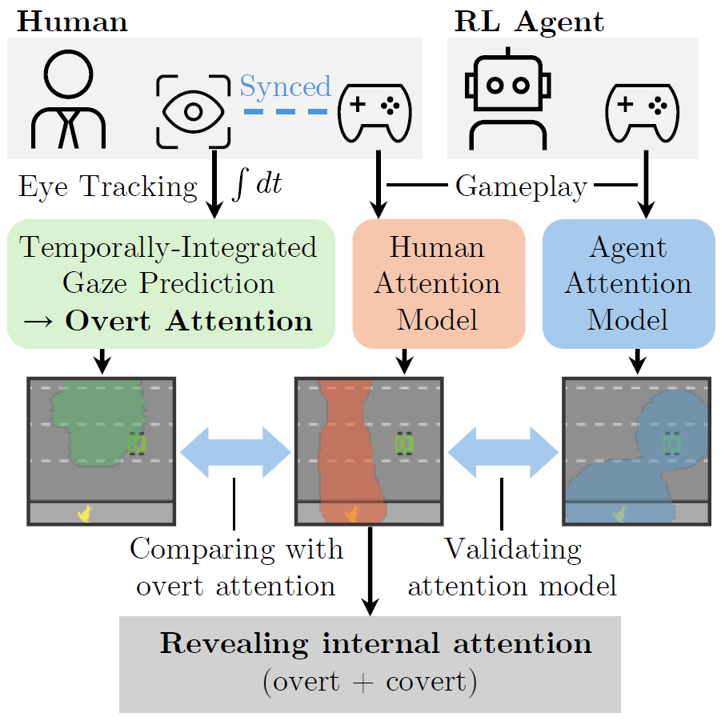
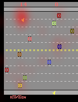
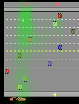
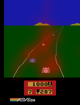
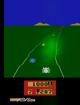

# revealing-attention

  

<h2 align="center"><b>Revealing Human Internal Attention Patterns from Gameplay Analysis for Reinforcement Learning</b></h2>

  <i>
    Predicting human internal attention from gameplay data alone. 
    <b>No eye-tracking required.</b>  
    These attention maps can be used to improve RL agent performance - creating human internal attention-guided RL agents!
  </i>

<table>
  <tr>
    <td align="center"><b>Revealed Attention</b></td>
    <td align="center"><b>Eye tracking</b></td>
  </tr>
  <tr>
    <td align="center"></td>
    <td align="center"></td>
  </tr>
  <tr>
    <td align="center"></td>
    <td align="center"></td>
  </tr>
  <tr>
    <td align="center"></td>
    <td align="center"></td>
  </tr>
</table>

arXiv: https://arxiv.org/abs/2504.11118
## How to Cite

If you use this code or refer to our work, please cite the following:

@misc{krauss2025revealingcovertattentionanalyzing,
      title={Revealing Covert Attention by Analyzing Human and Reinforcement Learning Agent Gameplay}, 
      author={Henrik Krauss and Takehisa Yairi},
      year={2025},
      eprint={2504.11118},
      archivePrefix={arXiv},
      primaryClass={cs.LG},
      url={https://arxiv.org/abs/2504.11118}, 
}

## Contents

Notebooks:
1. Conversion of Atari-HEAD and Atari Agents datasets to HDF5 replay buffers\
    Atari-Head data available at: https://zenodo.org/records/3451402 \
    Atari Agents available at: https://github.com/floringogianu/atari-agents
2. Autoencoder training
3. Construction of temporally-integrated overt attention (TIOA) target map and network training
4. Contextualized task-relevant (CTR) attention networks and action predictors training
5. Training of the plain and attention-guided reinforcement learning agents

Functions, models, training classes, utils in /src